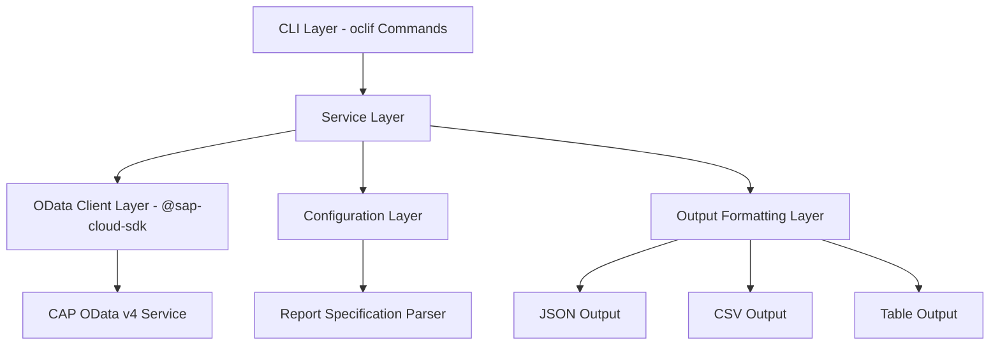

# Design Document: Financial Reports CLI

## Overview

The Financial Reports CLI is a TypeScript-based command-line tool built with oclif that provides a typed wrapper around @sap-cloud-sdk for querying OData v4 datasources (CAP services) to retrieve financial reports. The tool accepts report specification files as input and generates structured financial data output in multiple formats.

## Architecture

The application follows a layered architecture with clear separation of concerns:



### Key Architectural Principles

1. **Separation of Concerns**: CLI commands handle user interaction, services handle business logic, clients handle data access
2. **Type Safety**: Leverage TypeScript and @sap-cloud-sdk's typed OData clients throughout
3. **Configuration-Driven**: Report specifications drive query generation and execution
4. **Extensible Output**: Support multiple output formats through a pluggable formatting system

## Components and Interfaces

### CLI Command Layer

**ReportCommand** (oclif Command)

- Handles command-line argument parsing and validation
- Orchestrates the report generation workflow
- Manages error handling and user feedback

```typescript
interface ReportCommandArgs {
  specFile: string;
}

interface ReportCommandFlags {
  output?: 'json' | 'csv' | 'table';
  verbose?: boolean;
  destination?: string;
}
```

### Service Layer

**ReportService**

- Core business logic for report generation
- Coordinates between configuration parsing, OData querying, and output formatting

```typescript
interface ReportService {
  generateReport(
    specFile: string,
    options: ReportOptions
  ): Promise<ReportResult>;
}

interface ReportOptions {
  outputFormat: OutputFormat;
  verbose: boolean;
  destination?: string;
}

interface ReportResult {
  data: FinancialData[];
  metadata: ReportMetadata;
}
```

**ConfigurationService**

- Parses and validates report specification files
- Provides typed configuration objects

```typescript
interface ConfigurationService {
  parseSpecification(filePath: string): Promise<ReportSpecification>;
  validateSpecification(spec: ReportSpecification): ValidationResult;
}
```

### OData Client Layer

**FinancialDataClient**

- Wraps @sap-cloud-sdk OData v4 client functionality
- Provides typed methods for querying financial entities
- Handles authentication and connection management

```typescript
interface FinancialDataClient {
  queryBalanceSheet(
    entity: string,
    period: string
  ): Promise<BalanceSheetData[]>;
  queryIncomeStatement(
    entity: string,
    period: string
  ): Promise<IncomeStatementData[]>;
  queryCashFlow(entity: string, period: string): Promise<CashFlowData[]>;
}
```

### Output Formatting Layer

**OutputFormatter**

- Handles conversion of financial data to various output formats
- Provides consistent formatting across different report types

```typescript
interface OutputFormatter {
  formatAsJson(data: FinancialData[], metadata: ReportMetadata): string;
  formatAsCsv(data: FinancialData[], metadata: ReportMetadata): string;
  formatAsTable(data: FinancialData[], metadata: ReportMetadata): string;
}
```

## Data Models

### Report Specification

```typescript
interface ReportSpecification {
  entity: string;
  reportType: ReportType;
  period: string;
  destination?: DestinationConfig;
  filters?: FilterConfig[];
}

enum ReportType {
  BalanceSheet = 'BalanceSheet',
  IncomeStatement = 'IncomeStatement',
  Cashflow = 'Cashflow',
}

interface DestinationConfig {
  url: string;
  authentication?: AuthConfig;
}

interface FilterConfig {
  field: string;
  operator: 'eq' | 'ne' | 'gt' | 'lt' | 'ge' | 'le';
  value: string | number;
}
```

### Financial Data Models

```typescript
interface FinancialData {
  entity: string;
  period: string;
  reportType: ReportType;
  lineItems: LineItem[];
}

interface LineItem {
  account: string;
  description: string;
  amount: number;
  currency: string;
  category?: string;
}

interface BalanceSheetData extends FinancialData {
  assets: LineItem[];
  liabilities: LineItem[];
  equity: LineItem[];
}

interface IncomeStatementData extends FinancialData {
  revenue: LineItem[];
  expenses: LineItem[];
  netIncome: number;
}

interface CashFlowData extends FinancialData {
  operatingActivities: LineItem[];
  investingActivities: LineItem[];
  financingActivities: LineItem[];
  netCashFlow: number;
}
```

### Report Metadata

```typescript
interface ReportMetadata {
  generatedAt: Date;
  reportType: ReportType;
  entity: string;
  period: string;
  recordCount: number;
  executionTime: number;
}
```

## Correctness Properties

_A property is a characteristic or behavior that should hold true across all valid executions of a system-essentially, a formal statement about what the system should do. Properties serve as the bridge between human-readable specifications and machine-verifiable correctness guarantees._

### Converting EARS to Properties

Based on the prework analysis, I'll convert the testable acceptance criteria into universally quantified properties:

**Property 1: Specification Parsing and Validation**
_For any_ report specification file, parsing should successfully extract entity, report type, and period information when the specification is valid, and return descriptive error messages when invalid or missing required fields
**Validates: Requirements 1.1, 1.4, 1.5, 5.5**

**Property 2: Report Type Support**
_For any_ valid report specification with supported report types (BalanceSheet, IncomeStatement, Cashflow), the system should accept the specification, and reject specifications with unsupported report types while listing valid options
**Validates: Requirements 1.2, 5.2**

**Property 3: Period Format Validation**
_For any_ period string, the system should accept strings in YYYY-MM format and reject all other formats with specific error messages about format requirements
**Validates: Requirements 1.3, 5.1**

**Property 4: OData Service Configuration**
_For any_ OData service configuration, the system should accept valid authentication configurations and endpoint URLs, and reject invalid configurations with meaningful error messages
**Validates: Requirements 2.3, 2.5, 5.3**

**Property 5: Report Query Generation**
_For any_ valid combination of report type, entity, and period, the system should generate appropriate OData queries that filter data based on the specified period parameter
**Validates: Requirements 3.1, 3.2, 3.3, 3.4**

**Property 6: Structured Output Generation**
_For any_ financial report data, the system should return output in a structured, readable format that includes required metadata (report type, period, generation timestamp)
**Validates: Requirements 3.5, 6.4**

**Property 7: CLI Argument Processing**
_For any_ valid report specification file path provided as a command-line argument, the system should accept and process the argument correctly
**Validates: Requirements 4.1**

**Property 8: Exit Code Consistency**
_For any_ command execution, the system should exit with status code 0 on success and non-zero status codes on errors
**Validates: Requirements 4.3, 4.4**

**Property 9: Verbose Output Behavior**
_For any_ command execution with verbose flag enabled, the system should produce additional debugging output compared to normal execution
**Validates: Requirements 4.5**

**Property 10: Empty Result Handling**
_For any_ query that returns no matching records, the system should inform the user that no matching records exist
**Validates: Requirements 5.4**

**Property 11: Output Format Support**
_For any_ financial report data, the system should be able to generate output in JSON (default), CSV, and human-readable table formats
**Validates: Requirements 6.1, 6.2, 6.3**

**Property 12: File Output Redirection**
_For any_ output format and valid file path, the system should support redirecting output to files
**Validates: Requirements 6.5**

## Error Handling

The application implements comprehensive error handling at multiple levels:

### Input Validation Errors

- **Specification File Errors**: Invalid JSON, missing required fields, unsupported values
- **Period Format Errors**: Invalid date formats, out-of-range periods
- **File System Errors**: Missing files, permission issues, invalid paths

### OData Service Errors

- **Connection Errors**: Network failures, authentication failures, invalid endpoints
- **Query Errors**: Invalid entity names, malformed queries, service unavailable
- **Data Errors**: Empty result sets, data format inconsistencies

### Output Generation Errors

- **Formatting Errors**: Invalid data structures, unsupported output formats
- **File Output Errors**: Write permission issues, disk space problems

### Error Response Format

All errors follow a consistent structure:

```typescript
interface ErrorResponse {
  error: {
    code: string;
    message: string;
    details?: string;
    suggestions?: string[];
  };
  timestamp: Date;
  context?: Record<string, any>;
}
```

## Testing Strategy

The testing approach combines unit tests for specific functionality with property-based tests for universal correctness properties.

### Unit Testing

- **Configuration Parsing**: Test specific valid and invalid specification files
- **OData Client Integration**: Test connection establishment and query execution
- **Output Formatting**: Test specific data formatting scenarios
- **CLI Command Handling**: Test command-line argument parsing and help text

### Property-Based Testing

Property-based tests will be implemented using [fast-check](https://github.com/dubzzz/fast-check) for TypeScript, configured to run a minimum of 100 iterations per property test.

Each property test will be tagged with a comment referencing its design document property:

```typescript
// Feature: financial-reports-cli, Property 1: Specification Parsing and Validation
```

**Key Property Test Areas:**

- **Input Validation**: Generate random specification files and verify parsing behavior
- **Query Generation**: Generate random report parameters and verify correct OData queries
- **Output Formatting**: Generate random financial data and verify consistent output structure
- **Error Handling**: Generate various error conditions and verify appropriate responses
- **CLI Behavior**: Generate random command-line inputs and verify correct processing

### Integration Testing

- **End-to-End Workflows**: Test complete report generation flows
- **OData Service Integration**: Test against mock and real OData services
- **File System Integration**: Test specification file reading and output file writing

### Test Configuration

- Minimum 100 iterations per property-based test
- Mock OData services for consistent testing
- Test data generators for financial entities and periods
- Comprehensive error condition simulation
